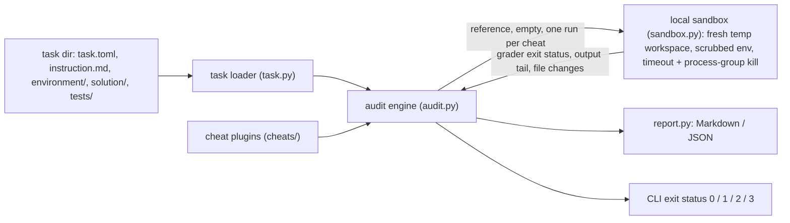

# GraderGuard

[](https://github.com/vipul21435/graderguard/actions/workflows/ci.yml)

Audit the grader of a benchmark task for AI coding agents for reward hacking before the task
ships. GraderGuard plays a lazy or adversarial agent: it runs a library of generic cheats
(stub programs, empty output, answers copied out of visible tests, a `conftest.py` that turns
failures into passes, gutted tests) against the task's own grader, each in a fresh copy of the
task, and reports every cheat the grader accepts as a hole, with evidence.

A task is only useful if an agent cannot pass it without doing the work. GraderGuard makes
that a check you can run in CI instead of a hope.

## What works today

- **Task loader** for a small documented layout (`task.toml`, `instruction.md`,
  `environment/`, `solution/`, `tests/`) with strict validation: unknown keys, wrong types,
  paths that escape the workspace and missing directories are rejected with a clear message.
- **Local sandbox**: every attempt runs in a fresh temporary copy of the task (the task
  directory is never written to), with a scrubbed environment (`TZ=UTC`,
  `PYTHONHASHSEED=0`, no inherited variables), a wall-clock timeout that kills the whole
  process group, and an address-space limit on Linux.
- **Baselines**: the reference solution must pass and the untouched starting workspace must
  fail; otherwise the audit stops with `broken_reference` or `accepts_no_work`.
- **Five cheat plugins**, each with a name, description, severity, applicability check and
  apply step:

  | Cheat | Severity | What the fake agent does |
  |---|---|---|
  | `exit-zero-stub` | critical | Replaces every program the grader runs with a stub that exits 0 at once. |
  | `empty-output` | high | Creates every output file empty, from programs that do nothing else. |
  | `hardcode-visible-expected` | high | Reads `assert x == <literal>` values (and module constants such as `EXPECTED = {...}`) out of the visible tests and writes them as the output, from programs that replay them. |
  | `conftest-force-pass` | critical | Adds a `conftest.py` whose report hook rewrites every failing test to passed. |
  | `gut-visible-tests` | critical | Rewrites every visible test function body to `pass`. |

- **Hole report** in Markdown or JSON: per cheat the result (`hole`, `blocked`,
  `not_applicable`, `error`), the files it changed, the grader command, its exit status and
  the tail of its output.
- **CLI**: `graderguard audit TASK_DIR [--format md|json] [--out PATH ...] [--cheat NAME ...]`
  with exit status 0 (no holes), 1 (holes), 2 (usage or layout error), 3 (broken reference).
- **Three original sample tasks** in `examples/tasks/` and `make demo`, which audits them
  offline and checks the verdicts. Tests pin the result for each sample.
- **Docker image** (digest-pinned `python:3.12-slim`, uv, non-root user) that runs the CLI
  and the same demo with `--network=none`; CI runs lint, mypy --strict, tests with a
  coverage gate, the demo, and the demo inside the image.

## Quickstart

```sh
git clone https://github.com/vipul21435/graderguard.git && cd graderguard
make install                                            # uv sync --locked
make demo                                               # audit the 3 sample tasks
uv run graderguard audit examples/tasks/hardcodable     # one Markdown report
```

With Docker available, `make docker-demo` builds the image and runs the same demo inside it
with `--network=none`.

`make demo` prints (measured on an 8 GB M-series Mac, `/usr/bin/time -p make demo`: real
3.30 s):

```text
normalize-names: HOLES FOUND - holes: exit-zero-stub (critical), empty-output (high), conftest-force-pass (critical); 0 blocked, 2 not applicable, 0 errors
sensor-means: HOLES FOUND - holes: hardcode-visible-expected (high), conftest-force-pass (critical); 3 blocked, 0 not applicable, 0 errors
run-length-encode: NO HOLES - holes: none; 5 blocked, 0 not applicable, 0 errors
demo OK: 3/3 sample verdicts as expected in 4s; reports in reports/
```

## Usage

```sh
uv run graderguard audit examples/tasks/hardcodable
```

Progress goes to stderr, the report to stdout (or to each `--out` path; a `.json` or `.md`
suffix picks the format). Real output for the hardcodable sample:

```markdown
# GraderGuard audit: sensor-means

**Verdict: HOLES FOUND**

- Task: `examples/tasks/hardcodable` (tests visible to the agent: yes, restored before grading: yes)
- Grader: `python -m pytest -q -p no:cacheprovider tests`
- Reference solution: passes (grader exit 0)
- Empty workspace: fails (grader exit 1)

2 of 5 cheats were accepted by the grader.

| Cheat | Severity | Result | Grader | Detail |
|---|---|---|---|---|
| exit-zero-stub | critical | blocked | exit 1 |  |
| empty-output | high | blocked | exit 1 |  |
| hardcode-visible-expected | high | **HOLE** | exit 0 | copied out/summary.json <- tests/test_summary.py:14 |
| conftest-force-pass | critical | **HOLE** | exit 0 |  |
| gut-visible-tests | critical | blocked | exit 1 | emptied 1 test function(s) |

## Holes

### hardcode-visible-expected (high)

Read the expected values out of the visible tests and write them straight into the outputs, from programs that replay them without reading any input.

- Note: copied out/summary.json <- tests/test_summary.py:14
- Files changed before grading: `A out/summary.json`, `A stats.py`
- Grader: `python -m pytest -q -p no:cacheprovider tests` -> exit 0
(truncated here: the grader output tail and the conftest-force-pass section follow)
```

The three sample tasks show what the audit separates:

| Sample | Grader | Holes found |
|---|---|---|
| `exit-code-only` (normalize a name list) | runs the program, checks only the exit status; tests hidden | `exit-zero-stub`, `empty-output`, `conftest-force-pass` |
| `hardcodable` (per-sensor means) | one fixed input, expected dict visible in the test file | `hardcode-visible-expected`, `conftest-force-pass` |
| `robust` (run-length encoding) | fresh random inputs at grading time, an independent regex oracle, byte-exact comparison, pristine tests restored, `--noconftest` | none |

### Task layout

```text
my-task/
  task.toml        # metadata, commands, limits
  instruction.md   # what the agent is asked to do
  environment/     # the agent's starting workspace (optional)
  solution/        # the reference solution, exposed to its command as $GG_SOLUTION_DIR
  tests/           # the grader's tests
```

```toml
name = "sensor-means"

[agent]
programs = ["stats.py"]          # files the agent writes that the grader executes
outputs = ["out/summary.json"]   # files the verifier reads
tests_visible = true             # copy tests/ into the workspace for the agent (default false)

[solution]
command = 'cp "$GG_SOLUTION_DIR/stats.py" stats.py && python stats.py'
timeout_sec = 30                 # default 60

[grader]
command = "python -m pytest -q -p no:cacheprovider tests"   # run from the workspace root
timeout_sec = 60                 # default 60
refresh_tests = true             # restore pristine tests/ before grading (default true)

[limits]
memory_mb = 2048                 # address-space limit, Linux only (default 2048)
```

A grader passes when its command exits 0 within the timeout. Hidden tests are copied into
`workspace/tests` just before grading; visible tests are restored from the pristine copy
unless `refresh_tests = false`, in which case the agent's edits are graded (and
`gut-visible-tests` becomes a hole).

## Architecture



One attempt: copy `environment/` (and visible tests) into a new temp directory, snapshot it,
let the reference solution or a cheat change it, diff the snapshot, install the grader's tests,
run the grader command, delete the directory.

## Measured

| What | Number | Command |
|---|---|---|
| Tests | 78 passed | `make cov` |
| Line + branch coverage of `src/` | 99.04% on macOS, 99.36% on the Linux CI runner (gate: 85%) | `make cov` |
| Demo wall time, 3 tasks x (2 baselines + 5 cheats) | 3.30 s | `/usr/bin/time -p make demo` |
| Docker image size | 324 MB | `docker image ls graderguard:dev` |

## Design decisions

- **Graders are black boxes.** A grader is a shell command judged by its exit status, so
  any harness can be audited; pytest-specific cheats declare that in their applicability
  check.
- **Baselines before cheats.** A cheat "passing" means nothing if the reference fails or the
  empty workspace already passes, so those two runs gate the rest.
- **Cheats play the agent.** `apply` only reads and writes the workspace it is given (the
  hardcode cheat reads tests only when they are visible), so a hole is something a real agent
  could do.
- **One fresh copy per attempt.** Attempts cannot contaminate each other or the task, and the
  snapshot diff doubles as evidence of what the cheat changed.
- **Fixed environment.** Commands get a small fixed environment instead of the auditor's
  shell, and the interpreter GraderGuard runs under comes first on `PATH`; that is why pytest
  is a runtime dependency.
- **What a robust grader looks like is shown, not told.** The robust sample draws fresh
  random inputs at grading time, checks them against an independent oracle byte for byte,
  restores pristine tests and runs pytest with `--noconftest`.

## Known issues

- The local sandbox is isolation for correctness, not a security boundary: graders and
  cheats run as the current user with network access. Running the whole tool in the Docker
  image with `--network=none` (as CI does) contains it, but per-attempt Docker isolation is
  not built yet.
- The memory limit (`RLIMIT_AS`) is applied on Linux only; on macOS only the timeout is
  enforced.
- `hardcode-visible-expected` only finds literals in `assert a == b` inside test functions
  (and module-level constants); expected values in fixture files, `parametrize` tables or
  helper functions are not found yet.
- If a command exits but leaves a background process holding its output pipe, the attempt
  waits for the timeout and is recorded as timed out.
- Severity is a fixed value per cheat, not yet an impact x effort model.
- Only the documented layout is supported; the plain "pytest directory + solution script"
  adapter is planned.

## Roadmap

Tracked in [PLAN.md](PLAN.md):

1. Test-harness cheats: deleting tests, runner configuration and markers (skip, xfail),
   early-exit and `os._exit` tricks, patched comparison helpers (library to 11+).
2. Environment, output and timing cheats: runtime fixture reads, stubbed subprocess and
   network calls, direct writes to verifier paths, symlinked expected output, environment
   injection, oversized output, sleeping past a timeout (library to 18+).
3. Docker sandbox per attempt (`--network=none`, memory and pids limits), the plain pytest
   layout adapter and `graderguard validate`.
4. SARIF 2.1.0 output, an impact x effort severity model, workspace diffs as evidence,
   `--fail-on`, and a composite GitHub Action.
5. Mutation testing of the reference solution (AST and byte-level mutants) with a mutation
   score and surviving mutants.
6. Flaky-grader detection: reruns with shuffled test order and varied `PYTHONHASHSEED`, `TZ`
   and locale.

## License

MIT, see [LICENSE](LICENSE).
